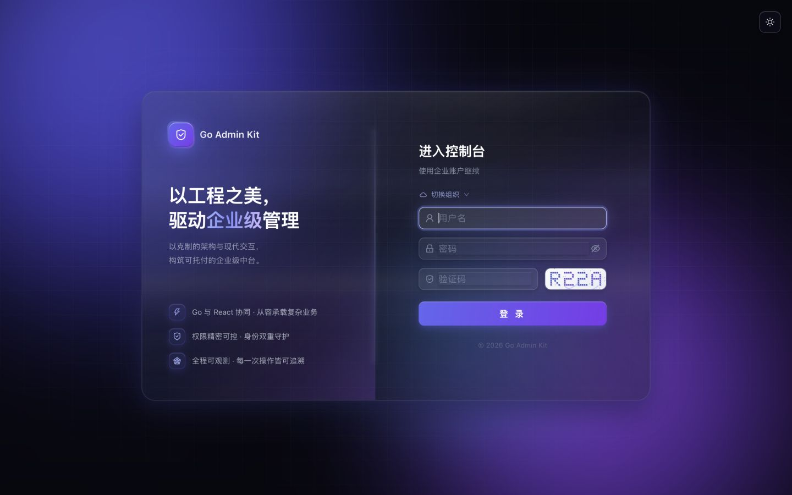
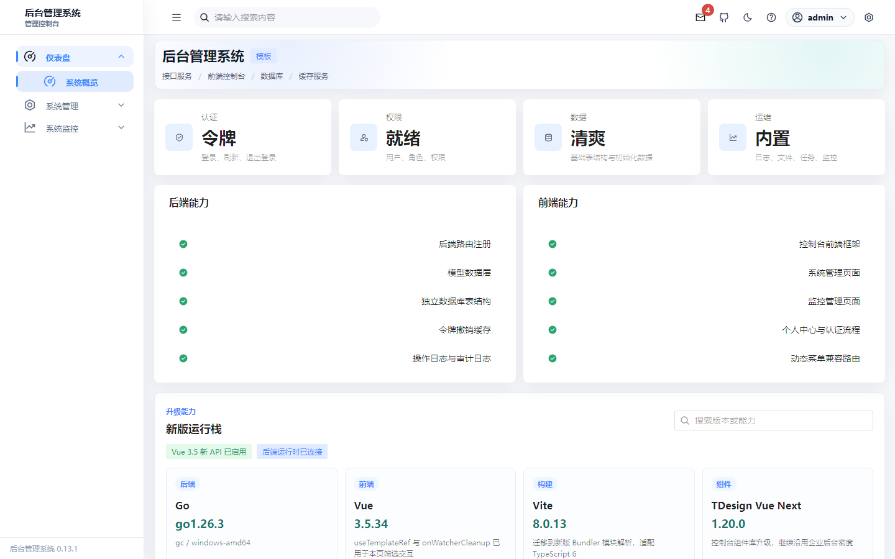
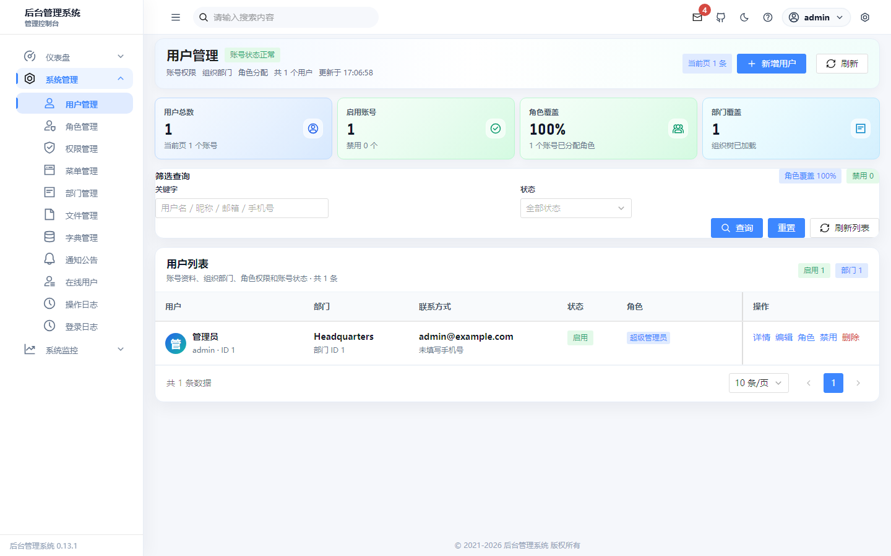
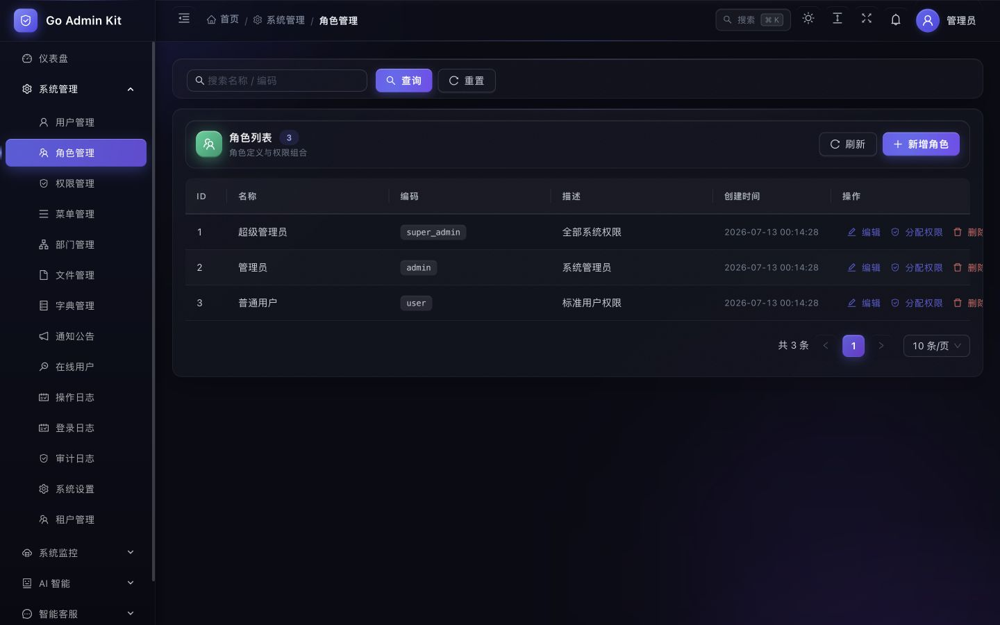
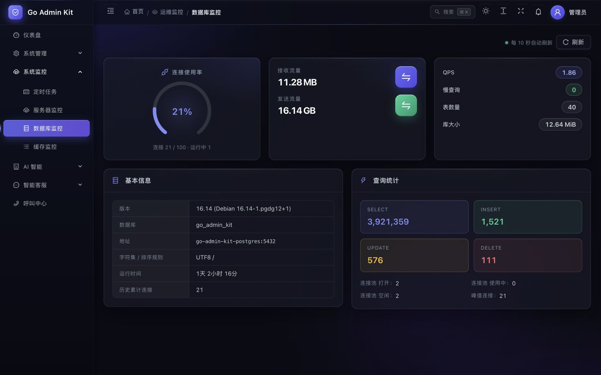
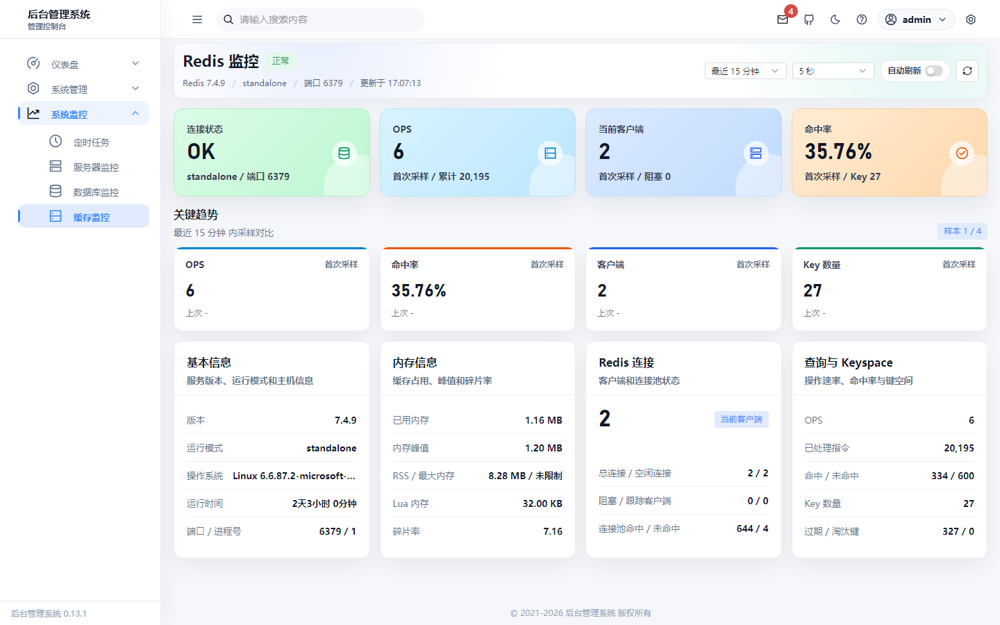

# Go Admin Kit

[](https://github.com/SuperiorChuo/go-admin-kit/actions/workflows/ci.yml)
[](LICENSE)
[](server/go.mod)
[](tdesign-vue-go/package.json)
[](tdesign-vue-go/package.json)

Go Admin Kit 是一套基于 Go + Gin、Vue 3 和 TDesign 的全栈后台管理脚手架，内置认证、RBAC、系统管理、审计日志、监控面板和 Docker 本地环境。项目已清理业务耦合内容，适合作为企业内部管理系统、运营后台或 SaaS 控制台的二次开发起点。

## 项目截图

这些截图来自当前项目真实运行页面，覆盖登录、系统概览、系统管理和监控页面。

| 登录页 | 系统概览 |
| --- | --- |
|  |  |

| 用户管理 | 角色管理 |
| --- | --- |
|  |  |

| MySQL 监控 | Redis 监控 |
| --- | --- |
|  |  |

## 技术栈

- 后端：Go 1.26.3、Gin、GORM、goose、JWT、Redis、MySQL
- 前端：Vue 3.5、Vite 8、TypeScript 6、Pinia、Vue Router、TDesign Vue Next 1.20
- 测试：Go test、Vitest、Playwright、Node.js test runner
- 工程：Docker Compose、GitHub Actions、OpenAPI 契约生成、uv 隔离 Python 辅助环境
- 可选能力：MinIO、Prometheus、Grafana、OpenTelemetry tracing

## 功能清单

- 登录、刷新 token、退出登录、token 撤销
- RBAC 权限、角色、菜单、部门和用户管理
- 字典、通知、文件上传、操作日志、登录日志
- 在线用户强制下线
- 任务调度、服务器监控、MySQL 和 Redis 监控页面
- 健康检查、Prometheus metrics、请求 ID、审计日志
- OpenAPI JSON 生成和前端类型生成
- Docker 一键启动 MySQL、Redis、后端和前端

## 目录结构

```text
.
├── server/              # Go + Gin 后端 API
├── tdesign-vue-go/      # Vue 3 + TDesign 前端控制台
├── deploy/              # Prometheus、Grafana、Tracing 配置
├── docs/                # 工程、安全、迁移和契约文档
├── scripts/             # OpenAPI 类型生成等辅助脚本
├── tests/               # API smoke 和契约测试
├── docker-compose.yml   # 本地完整栈编排
└── LOCAL_SETUP.md       # 本地联调说明
```

## 快速启动

```powershell
git clone https://github.com/SuperiorChuo/go-admin-kit.git
cd go-admin-kit
Copy-Item .env.example .env
docker compose up -d --build
```

默认地址：

- 前端：`http://localhost:3000`
- 后端：`http://localhost:8081`
- 健康检查：`http://localhost:8081/api/v1/health/ready`

默认管理员账号仅用于本地开发：

- 用户名：`admin`
- 密码：`admin123`

生产或共享环境请立即修改默认密码，并替换 `.env` 中的密钥和服务密码。

## 环境隔离

Docker Compose 使用项目专属容器、网络和数据卷，避免和其他项目的数据表混在一起：

- MySQL 容器：`go-admin-kit-mysql`
- Redis 容器：`go-admin-kit-redis`
- MySQL 数据卷：`go_admin_kit_mysql_data`
- Redis 数据卷：`go_admin_kit_redis_data`
- 默认数据库：`go_admin_kit`
- Docker 网络：`go-admin-kit-net`

如果本机已有 MySQL 或 Redis 占用 `3306`、`6379`，只需要在 `.env` 中调整宿主机端口：

```env
MYSQL_PORT=3307
REDIS_PORT=6380
```

容器内部仍然通过 `go-admin-kit-mysql:3306` 和 `go-admin-kit-redis:6379` 通信，不会影响后端配置。

Python 辅助工具统一使用 `uv` 和项目内 `.venv`：

```powershell
uv sync
uv run python --version
```

## 本地开发

只启动依赖服务：

```powershell
docker compose up -d go-admin-kit-mysql go-admin-kit-redis
```

启动后端：

```powershell
cd server
go run .\cmd\main.go
```

启动前端：

```powershell
cd tdesign-vue-go
npm install
npm run dev
```

## 数据库

首次创建 MySQL 数据卷时，Docker 会自动导入：

```text
server/docs/go_admin_kit.sql
```

也可以手动导入基线 SQL：

```powershell
make db-import
```

后续结构变更使用版本化迁移：

```powershell
make migrate-status
make migrate-up
make migrate-create NAME=add_example_table
```

迁移说明见 `docs/development/MIGRATIONS.md`。

## 验证

后端：

```powershell
cd server
go test ./...
go vet ./...
```

前端：

```powershell
cd tdesign-vue-go
npm run test
npm run build:type
npm run lint
npm run stylelint
npm run build
npm audit --omit=dev
```

E2E：

```powershell
npm run e2e:frontend
```

完整栈启动后的 API smoke：

```powershell
npm run test:smoke:unit
npm run smoke:api
```

API 契约生成与测试：

```powershell
npm run api:contract
npm run test:contract
```

## 配置入口

- 后端默认配置：`server/configs/config.yaml`
- 后端示例配置：`server/configs/config.example.yaml`
- Docker 环境变量：`.env.example`
- 数据库基线：`server/docs/go_admin_kit.sql`
- 数据库迁移：`server/migrations/`
- OpenAPI 契约：`server/docs/openapi.json`
- 本地代码图谱：`CODE_GRAPH.md`

## 安全提示

生产环境部署前请至少替换：

- `JWT_SECRET`
- MySQL 密码
- Redis 密码
- MinIO 密钥
- Grafana 密码
- 默认管理员密码策略
- `CORS_ALLOW_ORIGINS`

安全能力说明见 `docs/SECURITY.md`，发布前检查见 `docs/development/READINESS_CHECKLIST.md`。

## 开源协作

- 贡献指南：`CONTRIBUTING.md`
- 安全策略：`SECURITY.md`
- 问题反馈：`https://github.com/SuperiorChuo/go-admin-kit/issues`
- CI：`https://github.com/SuperiorChuo/go-admin-kit/actions`

发起 PR 前请运行相关验证命令，并在 PR 模板中说明影响范围、配置变化和测试结果。

## 路线图

- 将 Playwright E2E 纳入 GitHub Actions
- 补充 release notes 和 `v0.1.0` 首个开源版本
- 梳理更多二次开发示例页面
- 增加对象存储正式接入示例
- 补充部署到 Linux、Nginx、HTTPS 的生产指南

## License

本项目基于 [MIT License](LICENSE) 开源。
