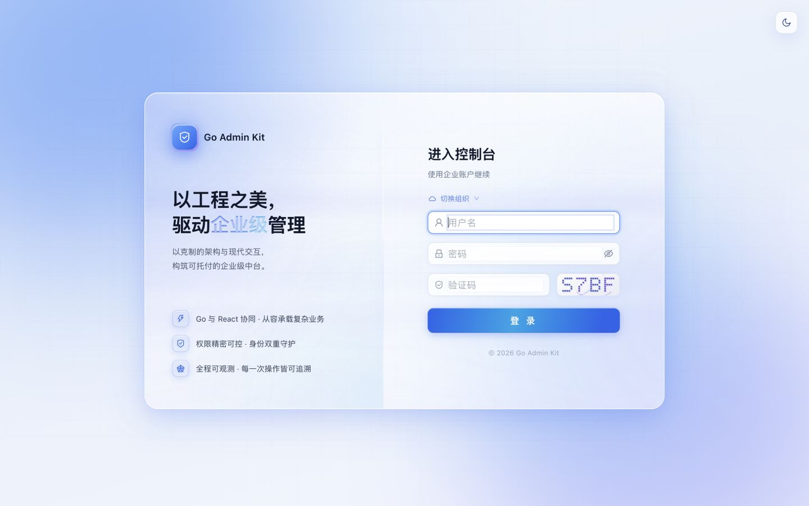
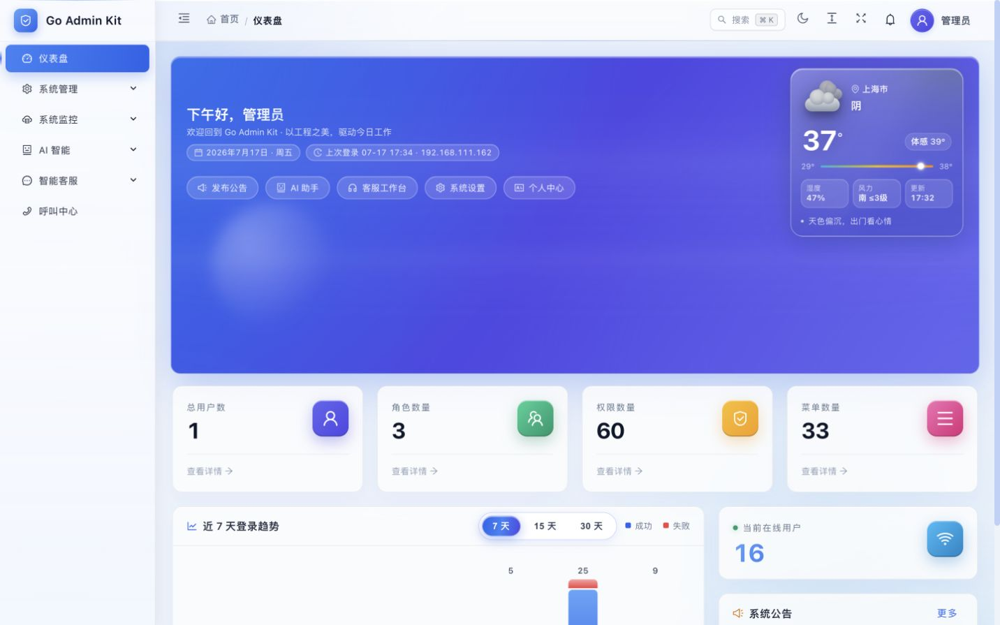
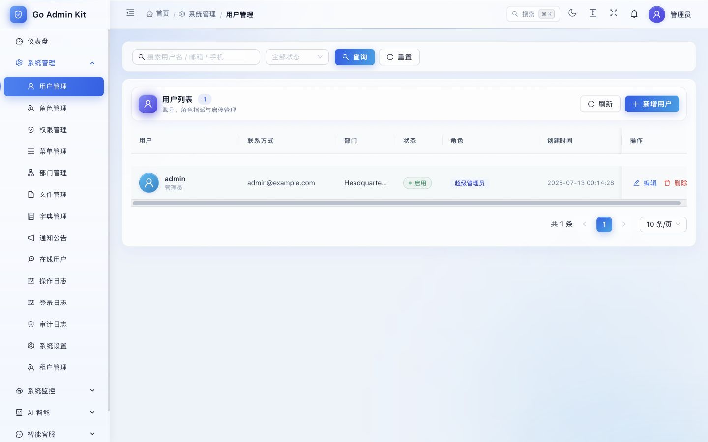
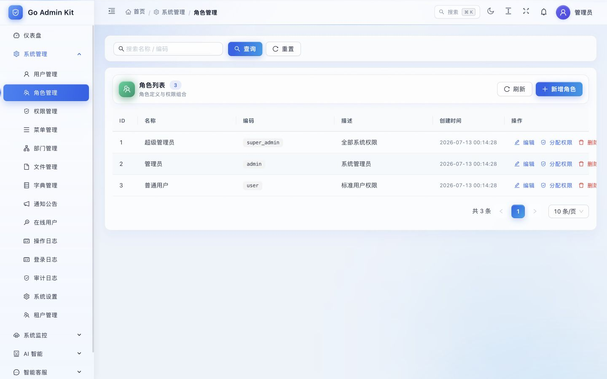
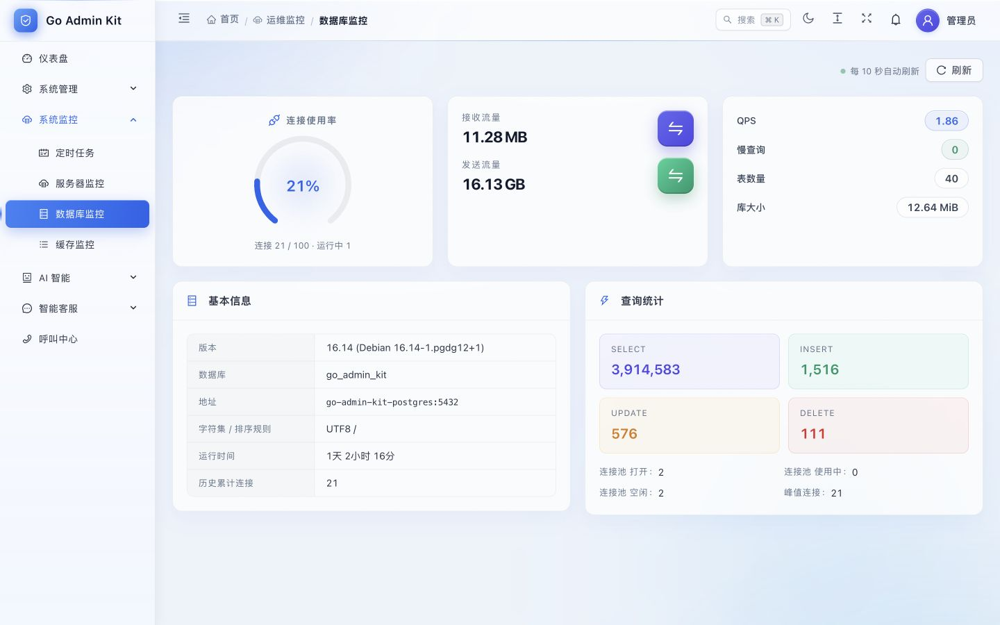
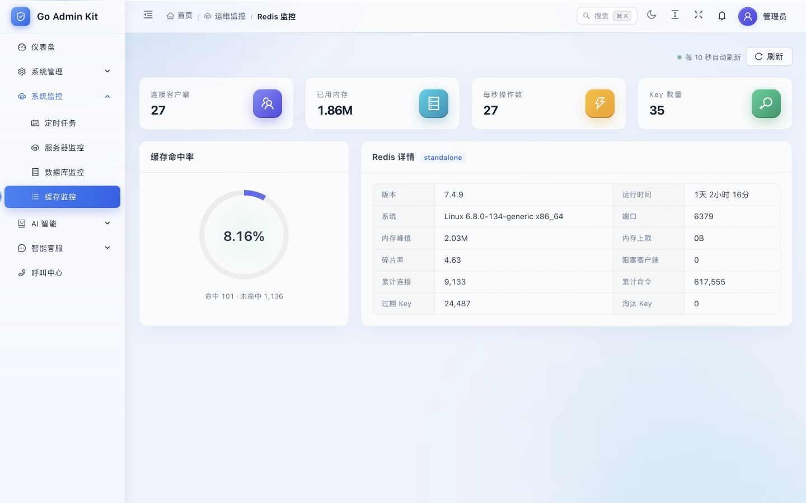
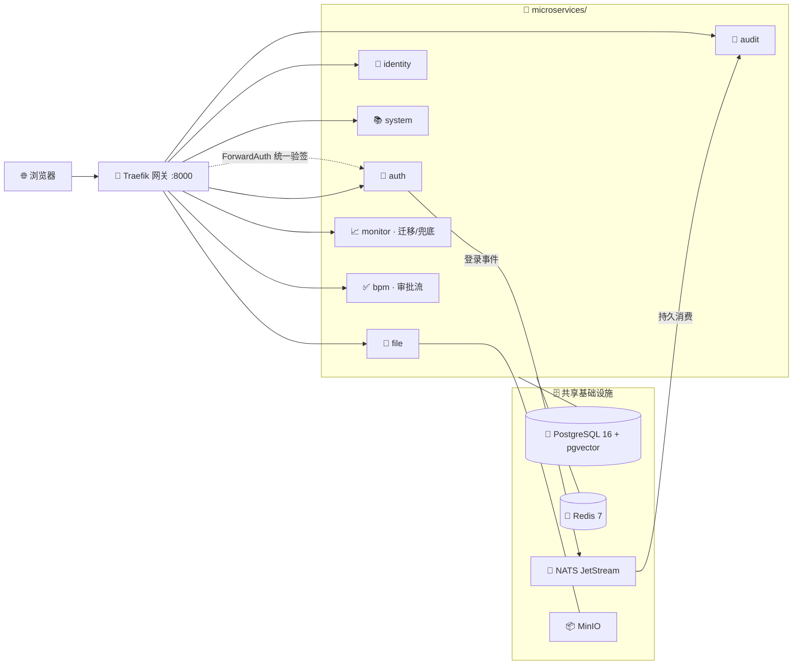

<!-- <p align="center">
  
</p> -->

# 🚀 GopherForge · Go 微服务后台管理脚手架

**GopherForge**（曾用名 `go-admin-kit`）是一套**开源的企业级 Go 微服务后台管理系统脚手架**：后端 Go + Gin 按域拆分 7 个基础服务，前端 React 19 + Ant Design 6，Traefik 网关统一鉴权，自带 RBAC 权限、多租户、审计日志、系统监控与代码生成器，`make compose-up` 一条命令拉起全栈（数据栈与应用栈分离，重建应用不触碰数据）。

> 当前发布候选版：`v0.2.0-rc.1`。这是 0.x 版本，API、数据库表结构和生成代码格式仍可能调整；上线前请按部署文档完成密钥替换、迁移备份和回滚演练。

- **适合谁**：需要快速搭建企业内部管理平台 / SaaS 管理后台的 Go 团队；前端更熟 React 而不想用 Vue 的团队；想要真微服务架构（而非单体）作为起点、又不想背业务包袱的项目。
- **和同类有何不同**：只含基础设施、零业务耦合——对比 gin-vue-admin、go-admin、RuoYi 系见 [同类项目对比](docs/comparison.md)。
- **多快能跑起来**：克隆后 `make compose-up`，约 3 分钟拉起网关 + 8 服务 + 前端 + PostgreSQL/Redis/NATS；或先玩 [在线 Demo](https://superiorchuo.github.io/gopherforge/)（纯前端假数据，任意账号可登录）。

<p align="center">
  <strong>✨ 企业级微服务后台脚手架 · 只含基础设施 · 开箱即用 ✨</strong><br/>
  🐹 Go + Gin &nbsp;·&nbsp; ⚛️ React + Ant Design &nbsp;·&nbsp; 🧩 Traefik 网关 + 8 服务
</p>

<p align="center">
  <a href="https://superiorchuo.github.io/gopherforge/"><strong>🖥️ 在线体验 Demo →</strong></a> · <a href="https://superiorchuo.github.io/gopherforge/docs/"><strong>📖 文档站</strong></a> · <a href="README.en.md">English</a><br/>
  <sub>纯前端演示模式（假数据，任意账号可登录）；完整功能克隆后 <code>make compose-up</code> 一键启动；候选版说明见 <a href="CHANGELOG.md">CHANGELOG</a></sub>
</p>

<p align="center">
  <a href="https://github.com/SuperiorChuo/gopherforge/actions/workflows/ci.yml"></a>
  <a href="LICENSE"></a>
  <a href="https://github.com/SuperiorChuo/gopherforge"></a>
  <a href="https://github.com/SuperiorChuo/gopherforge/network/members"></a>
  <a href="https://github.com/SuperiorChuo/gopherforge/issues"></a>
  
</p>

<p align="center">
  
  
  
  
  
  
  
</p>

<p align="center">
  
  
  
  
  
  
  
</p>

<p align="center">
  
  
  
  
  
  
  
</p>

---

## ✨ 为什么选 GopherForge

| 亮点 | 说明 |
|:-----|:-----|
| 🧩 **纯脚手架** | 只含平台无关的基础设施服务（认证/RBAC/系统/日志/文件/监控），不带业务耦合，是干净的起点。 |
| ⚛️ **前端统一** | React + Ant Design 深空/亮色双主题，一套视觉语言（渐变卡片墙 + 抽屉）。 |
| 🐳 **开箱即用** | Docker Compose 一键拉起依赖、网关/服务与前端；内置 RBAC、日志、监控、迁移。 |
| 🏗️ **工程完备** | CI、OpenAPI、健康检查、Prometheus、可选链路追踪与对象存储。 |
| 🛠️ **易扩展** | 加业务能力 = 加一个微服务 + 网关标签，不污染底座。 |

---

## 🖼️ 项目截图

| 页面 | 🌌 深空暗色 | ☁️ 白蓝亮色 |
| --- | --- | --- |
| 🔐 登录页 |  |  |
| 📊 系统概览 |  |  |
| 👥 用户管理 |  |  |
| 🛡️ 角色管理 |  |  |
| 🐘 数据库监控 |  |  |
| 🔴 Redis 监控 |  |  |

> 截图来自真实运行界面，统一使用桌面视口。

---

## 🧰 技术栈全景

### 🐹 后端

| 层级 | 技术 | 说明 |
|------|------|------|
| 语言 | **Go 1.26** | 高性能、强类型 |
| HTTP | **Gin** | 路由与中间件 |
| ORM | **GORM** + **pgx** | PostgreSQL 访问 |
| 迁移 | **goose** | 版本化 SQL 迁移 |
| 认证 | **JWT v5** | Access / Refresh、吊销与轮转 |
| 缓存 | **Redis 7** | 限流、在线用户、黑名单等 |
| 数据库 | **PostgreSQL 16** | 主存储（pgvector 镜像便于扩展） |

### ⚛️ 前端

| 层级 | 技术 | 说明 |
|------|------|------|
| 框架 | **React 19** | 现代并发渲染 |
| 语言 | **TypeScript** | 类型安全 |
| 构建 | **Vite 8** | 极速开发与构建 |
| UI | **Ant Design 6** | 企业级组件库 |
| 状态 | **Redux Toolkit** | 可预测状态 |
| 路由 | **React Router 7** | 客户端路由 |
| 请求 | **Axios** | 拦截器 / Token 刷新 |

### 🧩 微服务架构（`microservices/`）

| 组件 | 技术 | 说明 |
|------|------|------|
| 网关 | **Traefik** | 路由、ForwardAuth 统一验签 |
| 消息 | **NATS JetStream** | 登录事件解耦 |
| 服务 | auth / identity / system / audit / file / monitor / bpm + shared | 按域拆分的基础设施服务 |
| 契约 | **OpenAPI 3.1** | 从路由生成 + 前端类型 |

### 🔭 可观测与存储（可选）

| 组件 | 技术 |
|------|------|
| 指标 | **Prometheus** 📈（+ node_exporter 主机指标） |
| 看板 | **Grafana** 📊 |
| 告警 | **Alertmanager** 🚨（分组去抖 → 站内信闭环） |
| 链路 | **OpenTelemetry** + Jaeger 🔭 |
| 对象存储 | **MinIO**（S3 兼容） 📦 |

### ⚙️ 工程化

| 项 | 技术 |
|----|------|
| 容器 | **Docker Compose** 🐳 |
| CI | **GitHub Actions** ⚙️ |
| 提交规范 | **全中文** Conventional 风格（见 `CONTRIBUTING.md`） |

---

## ✅ 功能矩阵

| 能力 | 状态 |
|------|:----:|
| 🔐 登录 / JWT 刷新与撤销 / 验证码 / TOTP / OAuth | ✅ |
| 🪪 OAuth2 授权服务端 + OIDC（authorization_code+PKCE / client_credentials / id_token / JWKS / 发现文档，控制台管理应用与令牌） | ✅ |
| 🛡️ RBAC（用户、角色、权限、部门、菜单） | ✅ |
| 🏢 多租户（共享库 + tenant_id，登录带租户码） | ✅ |
| 📚 字典、公告、系统设置（DB 热配置）、在线用户 | ✅ |
| 📝 登录日志 / 操作日志 / 审计日志 | ✅ |
| 📁 文件上传（MinIO / 本地） | ✅ |
| 🖥️ 服务器 / PostgreSQL / Redis / 定时任务监控 | ✅ |
| ❤️ 健康检查、Prometheus metrics、微服务健康总览（并发探测各服务 ready） | ✅ |
| 🚨 告警闭环（node_exporter + 告警规则 + Alertmanager → 站内信，服务down/磁盘/内存/5xx） | ✅ |
| 💓 任务中心（分布式任务心跳上报 `shared/pkg/jobbeat`，超期即亮红） | ✅ |
| 📋 审批流引擎（流程定义 / 待办中心 / 会签或签 / 终态回调） | ✅ |
| 🚪 Traefik 网关 + ForwardAuth | ✅ |
| 📡 NATS 登录事件 | ✅ |
| 🐳 Docker Compose 一键启动 | ✅ |

---

## 🗺️ 架构总览



- 业务服务只信任网关注入的 `X-Auth-*` 头，宿主机端口默认只绑 loopback，外部流量一律经网关。
- `monitor` 持有 `PathPrefix(/api)` 兜底路由（priority 1），并负责共享 goose 迁移。

---

## 📂 仓库结构

```text
gopherforge/
├── microservices/                 # 🧩 微服务脚手架
│   ├── services/
│   │   ├── auth/                  # 🔐 认证、令牌、网关验签
│   │   ├── identity/              # 👥 用户 / 角色 / 权限 / 部门
│   │   ├── system/                # 📚 菜单 / 字典 / 公告 / 设置
│   │   ├── audit/                 # 📝 日志与事件消费
    │   │   ├── file/                  # 📁 文件与 uploads
    │   │   ├── bpm/                   # ✅ 轻量审批流引擎
    │   │   ├── shared/                # 🧰 跨服务共享包（日志/响应/脱敏）
│   │   └── monitor/               # 📈 监控、健康、共享迁移、兜底
│   ├── web/                       # ⚛️ React + Ant Design
│   ├── docker-compose.yml
│   └── README.md
├── platform/deploy/               # 🔭 Prometheus / Grafana / OTel
├── docs/                          # 📖 工程文档
│   ├── PRODUCT_LINES.md
│   └── design/                    # 数据边界 / 多租户等专项设计
├── CONTRIBUTING.md                # 🤝 贡献与提交规范
└── LOCAL_SETUP.md                 # 💻 本地联调摘要
```

---

## 🚀 快速开始

### 📋 环境要求

- 🐳 [Docker Desktop](https://www.docker.com/products/docker-desktop/)
- 可选本地开发：🐹 Go **1.26.3+**、📦 Node.js **20.19+ / 22.12+**（推荐 24）、npm

### 🧩 启动

```bash
git clone https://github.com/SuperiorChuo/gopherforge.git
cd gopherforge/microservices
cp .env.example .env
cd .. && make compose-up      # 自动：共享网络 → infra 数据栈 → 应用栈
```

不用 make 的话，等价的三条命令（数据栈与应用栈分离，重建应用不碰数据）：

```bash
cd microservices
docker network inspect go-admin-kit-net >/dev/null 2>&1 || \
  docker network create --subnet 172.28.0.0/16 go-admin-kit-net
docker compose -p go-admin-kit-infra -f docker-compose.infra.yml up -d
docker compose up -d --build
```

| 入口 | 地址 |
|------|------|
| 🚪 统一网关（推荐） | http://localhost:8000 |
| ⚛️ 前端直连 | http://localhost:3000 |
| ❤️ 健康检查 | http://localhost:8000/api/v1/health/ready |
| 🔐 认证服务调试 | http://localhost:8082 |

更多 👉 [microservices/README.md](microservices/README.md)

### 🔑 默认账号（仅本地开发）

| 用户名 | 密码 |
|--------|------|
| `admin` | `admin123` |

> ⚠️ 生产环境请立即修改密码，并替换 `.env` 中的 `JWT_SECRET`、数据库与中间件密钥。

---

## 🔌 端口一览

| 用途 | 端口 |
|------|------|
| 前端 | `3000`（推荐走网关 `8000`） |
| API | 经网关 `8000` / 各服务调试 `8081+` |
| PostgreSQL | `5432` |
| Redis | `6379` |

冲突时在 `microservices/.env` 中修改 `*_PORT` 即可。

---

## 💻 本地开发（可选）

下面的长时间运行命令请分别放在三个终端执行：

```bash
# 终端 1：只起数据栈（PG/Redis/NATS）
cd microservices
make -C .. infra-up

# 终端 2：启动要调试的 Go 服务（以 auth 为例）
cd microservices/services/auth
go run ./cmd

# 终端 3：启动前端 HMR
cd microservices/web
npm ci
npm run dev
```

完整联调说明 👉 [LOCAL_SETUP.md](LOCAL_SETUP.md)

---

## 🧪 验证

```bash
cd microservices
(cd services/monitor && go test ./... && go vet ./...)
(cd web && npm run lint && npm run build)
npm run test:smoke:unit && npm run test:contract
API_BASE_URL=http://127.0.0.1:8000/api/v1 npm run smoke:api
```

OpenAPI：

```bash
cd microservices
npm run api:contract
git diff --exit-code -- services/monitor/docs/openapi.json
```

---

## 📁 配置与文档

| 说明 | 路径 |
|------|------|
| 环境变量 | [`microservices/.env.example`](microservices/.env.example) |
| 迁移 / OpenAPI | `microservices/services/monitor/migrations/`、`docs/openapi.json` |
| 📖 **文档站（教程/模块文档/二开指南）** | https://superiorchuo.github.io/gopherforge/docs/ |
| 同类项目对比 | [`docs/comparison.md`](docs/comparison.md) |
| 产品线对照 | [`docs/PRODUCT_LINES.md`](docs/PRODUCT_LINES.md) |
| 安全说明 | [`docs/SECURITY.md`](docs/SECURITY.md) · [`SECURITY.md`](SECURITY.md) |
| 工程说明 | [`docs/ENGINEERING.md`](docs/ENGINEERING.md) |

---

## 🔒 安全提示

上线前请至少替换：

- 🔑 `JWT_SECRET`
- 🐘 PostgreSQL / 🔴 Redis / 📦 MinIO / 📊 Grafana 等密码与密钥
- 👤 默认管理员密码策略
- 🌐 `CORS_ALLOW_ORIGINS`

---

## 🛠️ 如何扩展业务

这是一个**干净的脚手架**。要加业务能力（如 IM、CRM、AI 等），推荐：

1. 在 `microservices/services/` 下新建一个业务微服务，加入 `go.work`。
2. 在 `docker-compose.yml` 补一个服务块 + Traefik 路由标签（`PathPrefix` + 可选 ForwardAuth）。
3. 迁移落到 `monitor/migrations/`（共享 goose 真源）。
4. 前端在 `web/src/pages/` 加页面、`api/` 加接口、菜单种子补条目。

> 原则：底座保持通用，业务域以「新微服务 + 网关标签」接入，避免把脚手架做成巨石。

---

## 🤝 开源协作

<p>
  <a href="CONTRIBUTING.md"></a>
  <a href="https://github.com/SuperiorChuo/gopherforge/issues"></a>
</p>

- 贡献指南 👉 [CONTRIBUTING.md](CONTRIBUTING.md)（**提交标题与正文须全中文**）
- CI 👉 https://github.com/SuperiorChuo/gopherforge/actions

---

## 📄 License

本项目基于 [MIT License](LICENSE) 开源。

如果这个项目对你有帮助，欢迎 ⭐ **Star** · 🍴 **Fork** · 🔧 **PR**，一起把它打造成更好用的企业中台脚手架！
